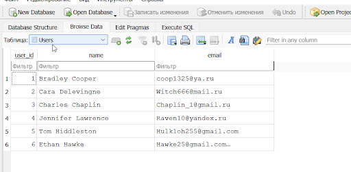
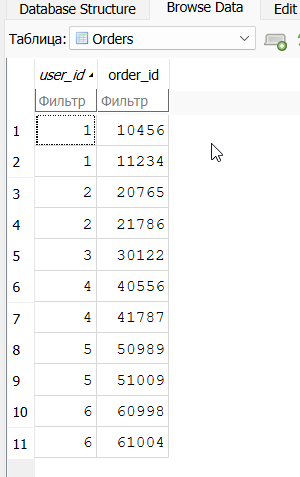
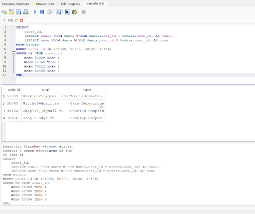
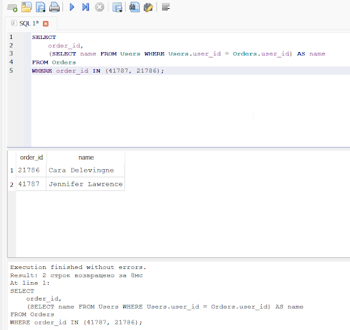
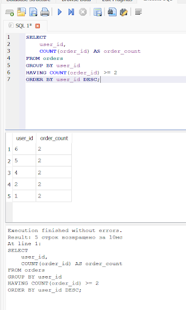
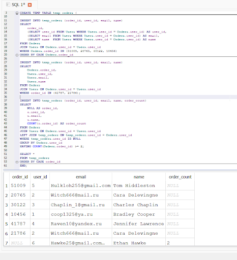

**Тестовое задание на позицию QA Engineer**

**Ларин-Черняховский Илья Андреевич**

**Подготовительная часть**   

**Задание 1**   
1.а  

1.б  

1.в

1.г  

Задание 2

1)Проверка позитивного сценария:  
{  
"name": "John Doe",  
"email": "john@example.com",  
"password": "Pass123\!"  
}  
Ожидаемый результат \- 201 и тело с данными  
2\) Проверка негативных сценариев:   
а) пустое тело \- 400  
б)отсутствие обязательного поля (email) \- 400  
в)неправильный формат email \- 400   
г)короткий пароль \- 400  
д)использование уже зарегистрированного email \- 409  
е)неверный тип данных \- 400  
3\) Проверка граничных значений   
4)Проверка ошибок сервера:  
а) Get вместо Post \- 405  
б) Симуляция недоступности БД \- 500 
